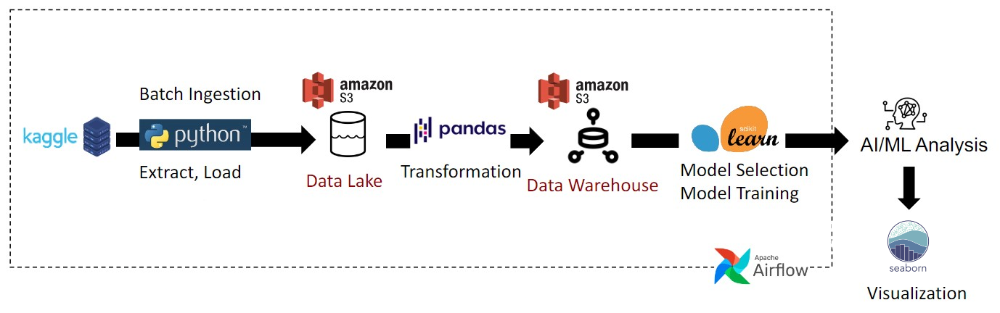

# Predicting Champions: An Olympic Medals Data Pipeline
**ECE 5984:** Data Engineering Project

By: Maximiliano Aedo Espicto, Paola Cando, and Sheila Talty
## Description

### Project's Function
The Summer Olympic Games, which are held every four years, have always captivated the hearts and minds of those who live in competing countries. There is no greater thrill than watching the top athletes in your country take the global stage and achieve the unthinkable – winning the gold medal. When the games occur, the question on every spectator's mind is always the same: who will be the grand victor of the Olympic games? One metric to answer this question is the overall medal count. The country that wins the most medals is the one with the strongest athletes. This project aims to answer that question. With the Olympic Games coming soon to France in 2024, this project will aim to build a data engineering pipeline that can predict which country will win the most medals. Cambridge Dictionary defines data as “information, especially facts or numbers, collected to be examined and considered and used to help decision-making, or information in an electronic form that can be stored and used by a computer” (1). This project aims to synthesize the different technologies that go into a data engineering pipeline to design, build, and maintain the infrastructure and systems that support the collection, storage, and analysis of data. This pipeline will be used to train different machine learning algorithms to find the best one that can predict the athletes.

### Dataset
The dataset we used for this project came from Kaggle and is entitled "120 years of Olympic History: Athletes and Results" available at: https://www.kaggle.com/datasets/heesoo37/120-years-of-olympic-history-athletes-and-results. 

This is a historical dataset on the modern Olympic Games, including all the Games from Athens 1896 to Rio 2016. The author scraped this data from www.sports-reference.com in May 2018. The data is structured as an Analytics Base Table (ABT), a basic structure made from columns and rows, where each row contains a value for both descriptive and target features for which predictions have been generated [1]. The dataset is comprised of over 270,000 entries across 15 columns. Each entry represents an individual athlete’s competition. 14 of them are considered the features (parameters), and the last column contains the target feature or prediction values. 

#### Feature Names and Description
| Feature | Description |
| --- | --- |
|ID | Unique number for each athlete |
| Name | Athlete's name |
| Sex | M or F |
| Age | Integer |
| Height | In centimeters |
| Weight | In kilograms |
| Team | Team name |
| NOC | National Olympic Committee 3-letter code |
| Games | Year and season |
| Year | Integer |
| Season | Summer or Winter |
| City | Host city |
| Sport | Sport |
| Event | Event |
| Medal | Gold, Silver, Bronze, or NA |

### Tools and Technologies
- Batch Ingestion - [Kaggle API](https://www.kaggle.com/docs/api)
- Orchestration - [Airflow](https://airflow.apache.org)
- Data Transformation - [Pandas](https://pandas.pydata.org/) 
- Model Training & Selection - [Sci-kit Learn](https://scikit-learn.org/stable/)
- Data Lake & Warehouse - [Amazon AWS S3](https://aws.amazon.com/s3/)
- Language - [Python](https://www.python.org/)
- Model Results Visualization - [Seaborn](https://seaborn.pydata.org/)

### Pipeline Architecture


### Data Quality Assessment
As this data was scraped by a group of people from a third-party website that tracks sporting events, there is a possibility that this data could’ve been perturbed. However, the website that hosts the dataset is compiled by a group of self-proclaimed Olympic Game enthusiasts, which speaks to its credibility. The authenticity of the data is further affirmed by its historical scope, spanning back to the inaugural Olympic Games in 1896. 

### Data Provenance
Since the publication of this dataset in 2018, it has been modified several times by the Kaggle authors: Marco Giuseppe de Pinto, Senior Program Manager at Amazon (https://www.kaggle.com/marcogdepinto), The ML PhD Student, a PhD Candidate at Federation University, Melbourne, Victoria, Australia (https://www.kaggle.com/themlphdstudent), and Josh, a Data Scientist at Siemens Energy, New York, New York, United States (https://www.kaggle.com/joshuaswords), further enhancing its accuracy and usability.
- 24/08/2018 - New section added: what is the median height/weight of an Olympic medalist?
- 25/08/2018 - Inserted a new section "Evolution of the Olympics over time"
- 26/08/2018 - Added the sections 'Variation of age and weight along time' with 4 new graphs (boxplot and pointplot).
- 27/08/2018 - Added the section 'Variation of height along time' with 2 new pointplots, added a short analysis of age over time for Italian athletes.
- 28/08/2018 - Added a new section about change in height and weight for Gymnasts over time.
- 29/08/2018 - Added a new section about change in height and weight for Lifters over time, added index of content at the beginning of the kernel.

### Exploratory Data Analysis (EDA): 
In data analysis, a comprehensive understanding of features in the Analytical Base Table (ABT) is crucial. Prior to building predictive models, thorough data exploration is essential. Tableau proves valuable for visualizing, understanding and uncovering correlations among features within the ABT.


### Data Transformations
In order to prepare our dataset for the machine learning models, it was necessary to transform it into a clean dataset. Our pipeline performs the following transformations in this specific order:
1. Filter out all of the winter games - As our project focuses solely on summer games, winter games are extraneous
2. Drop the NOC, ID, Name, Games, Season colums - NOC, ID, and Name columns essentially serve as identifiers and do not yield any substantial gain for our machine learning models. Season is removed because we are solely using summer games. Games column is removed because it contains the year and season, one of which is still present and the other is removed.
3. Replace NaNs in the Medals column with No Medals - This was done to fill in the missing value in the medals column
4. Label encode the medal column - This transforms the categorical feature into an ordinal feature. The following values were encoded: 1: Gold, 2: Silver, 3: Bronze, 4: No Medal
5. One-hot encode Sex, Team, City, Sport, and Event columns - In order to utilize categorical variables in our models, they had to be numerically encoded so that the models could learn from them. One-hot encoding allows for this without extra relationships being introduced (such as a ranked relationship like in the Label encoding) 

### Machine Learning Models Ml
A classification model is a machine learning type of modeling used to predict the categories or classes of a given data set. In this case, we processed, trained, and evaluated the "120-years-of-olympic-history-athletes-and-results" dataset using four different models: Artificial Neural Networks (MPL), Decision Tree  Classifier(CLF), K-Nearest Neighbors (KNN), and Random Forest (RF), to predict the multi-categorical variable 'medal'. 


After comparing the results, we can conclude that the Random Forest classifier was the best performer overall. The metrics achieved were similar to the other models, but the Random Forest classifier ran the faster computational time, and the complexity was nominal.
The Neural Network model could be improved by testing different architectures. However, it's important consider the objectives of the classification model and factors such as time, computation, and performance. In order to efficient use and maximize the prediction tool.
Overall, the Random Forest classifier was the best choice for this specific model. It is fundamental to notice that every prediction case is unique, hence the necessity to evaluate each model as an exclusive case and choose the classifier that best suits the specific needs of each application. 
The data provided for a classification problem has their own characteristics that makes it unique, hence the importance of the understanding and analysis of it before start processing a model. When it comes down to choose what specific method is the best to be use for a classification problem, the data to be utilized plays a role in the process of selection the algorithm. For instances, some algorithms can work with categorical data, or fewer samples of data while others require more samples. In our specific case our target medal has a specific imbalance due to the categorical features “Gold”, “Silver”, ”Bronze”, and ”No medal”.


### Thorough Investigation
Our project showed you can predict Olympic medal outcome based on historical data with a high level of acciraacy and high performance. To scale up this project, the data from Tokyo 2020 as well as real-time data into the dataset. The models could also be used in other sports competitions to predict the winners. Technically, other machine learning algrotisms can be implemeted


## Setup
### Installation
Before you get the code running, you will need to install the following Python packages.

```
pip install pandas
pip install scikit-learn
pip install kaggle
pip install matplotlib
pip install seaborn
pip install numpy
```

### Kaggle API Authentication
After you install the Kaggle package, you must create an authentication key from Kaggle and upload it locally to your device before running the code to download the datasets. Instructions are provided [on the Kaggle website.](https://www.kaggle.com/docs/api) 

If you run into issues with this step, you can manually download the dataset from Kaggle as long as you store it into the expected file structure. 

### Local vs Amazon AWS
This project is set up to function on an Amazon EC2 instance running the docker container utilized in class. If you are attempting to run the project on your local machine, follow the instructions to "de-AWS" the python files. 

### S3 Directory Link
At the top of each file (batch_ingest, transform, models, analyze), you MUST specify the outmost folder for an S3 bucket. For example, this project was set up to go to "s3://\[CLASS_BUCKET\]/final_project". The code is set up to send it to specific folders inside the S3 bucket for your convenience, so only one folder is necessary per file.

### Running the Code
In order to run the code, you need to transfer all of the python files in the dags folder into airflow dags container. The easiest way to do is is to create each file individually using the `nano [filename].py` command and copying over the code.

From there, run airflow in standalone mode and you can run the dag. It will take 30 minutes - 1 hour to run.


# TO-DO:
- Include Results Infographic

## References
[1] John D. Kelleher, Brian Mac Namee, Aoife D'Arcy. 2020. Fundamentals of machine learning for predictive data analytics: algorithms, worked examples, and case studies. Data to Insights to Decisions, Data exploration, pp. 23 to 113.

[2] Wilkinson, L. and Friendly, M., 2009. The history of the cluster heat map. The American Statistician, 63(2), pp.179-184. 

