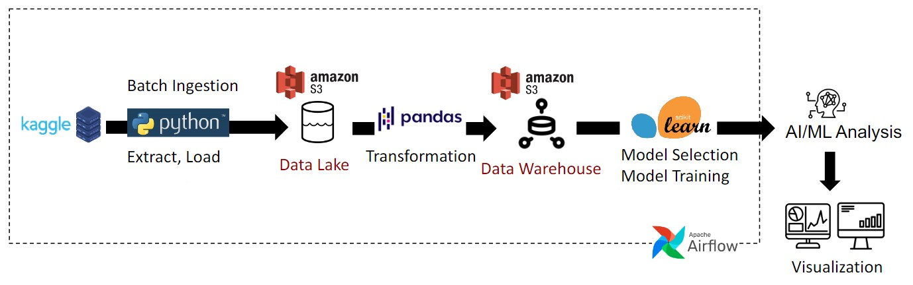

# Predicting Champions: An Olympic Medals Data Pipeline
**ECE 5984:** Data Engineering Project
By: Maximiliano Aedo Espicto, Paola Cando, and Sheila Talty
## Description

### Project's Function
The Summer Olympic Games, which are held every four years, have always captivated the hearts and minds of those who live in competing countries. There is no greater thrill than watching the top athletes in your country take the global stage and achieve the unthinkable – winning the gold medal. When the games occur, the question on every spectator's mind is always the same: who will be the grand victor of the Olympic games? One metric to answer this question is the overall medal count. The country that wins the most medals is the one with the strongest athletes. This project aims to answer that question. With the Olympic Games coming soon to France in 2024, this project will aim to build a data engineering pipeline that can predict which country will win the most medals. Cambridge Dictionary defines data as “information, especially facts or numbers, collected to be examined and considered and used to help decision-making, or information in an electronic form that can be stored and used by a computer” (1). This project aims to synthesize the different technologies that go into a data engineering pipeline to design, build, and maintain the infrastructure and systems that support the collection, storage, and analysis of data. This pipeline will be used to train different machine learning algorithms to find the best one that can predict the athletes.

### Dataset
The dataset we used for this project came from Kaggle and is entitled "120 years of Olympic History: Athletes and Results" available at: https://www.kaggle.com/datasets/heesoo37/120-years-of-olympic-history-athletes-and-results. 

This is a historical dataset on the modern Olympic Games, including all the Games from Athens 1896 to Rio 2016. The author scraped this data from www.sports-reference.com in May 2018. The data is structured as an Analytics Base Table (ABT), a basic structure made from columns and rows, where each row contains a value for both descriptive and target features for which predictions have been generated [1]. The dataset is comprised of over 270,000 entries across 15 columns. Each entry represents an individual athlete’s competition. 14 of them are considered the features (parameters), and the last column contains the target feature or prediction values. 

#### Feature Names and Description
| Feature | Description |
| --- | --- |
|ID | Unique number for each athlete |
| Name | Athlete's name |
| Sex | M or F |
| Age | Integer |
| Height | In centimeters |
| Weight | In kilograms |
| Team | Team name |
| NOC | National Olympic Committee 3-letter code |
| Games | Year and season |
| Year | Integer |
| Season | Summer or Winter |
| City | Host city |
| Sport | Sport |
| Event | Event |
| Medal | Gold, Silver, Bronze, or NA |
### Tools and Technologies
- Batch Ingestion - [Kaggle API](https://www.kaggle.com/docs/api)
- Orchestration - [Airflow](https://airflow.apache.org)
- Data Transformation - [Pandas](https://pandas.pydata.org/) 
- Model Training & Selection - [Sci-kit Learn](https://scikit-learn.org/stable/)
- Data Lake & Warehouse - [Amazon AWS S3](https://aws.amazon.com/s3/)
- Language - [Python](https://www.python.org/)


### Pipeline Architecture


### Data Quality Assessment
As this data was scraped by a group of people from a third-party website that tracks sporting events, there is a possibility that this data could’ve been perturbed. However, the website that hosts the dataset is compiled by a group of self-proclaimed Olympic Game enthusiasts, which speaks to its credibility. The authenticity of the data is further affirmed by its historical scope, spanning back to the inaugural Olympic Games in 1896. 

### Data Provenance
Since the publication of this dataset in 2018, it has been modified several times by the Kaggle authors: Marco Giuseppe de Pinto, Senior Program Manager at Amazon (https://www.kaggle.com/marcogdepinto), The ML PhD Student, a PhD Candidate at Federation University, Melbourne, Victoria, Australia (https://www.kaggle.com/themlphdstudent), and Josh, a Data Scientist at Siemens Energy, New York, New York, United States (https://www.kaggle.com/joshuaswords), further enhancing its accuracy and usability.
- 24/08/2018 - New section added: what is the median height/weight of an Olympic medalist?
- 25/08/2018 - Inserted a new section "Evolution of the Olympics over time"
- 26/08/2018 - Added the sections 'Variation of age and weight along time' with 4 new graphs (boxplot and pointplot).
- 27/08/2018 - Added the section 'Variation of height along time' with 2 new pointplots, added a short analysis of age over time for Italian athletes.
- 28/08/2018 - Added a new section about change in height and weight for Gymnasts over time.
- 29/08/2018 - Added a new section about change in height and weight for Lifters over time, added index of content at the beginning of the kernel.


## References
[1] John D. Kelleher, Brian Mac Namee, Aoife D'Arcy. 2020. Fundamentals of machine learning for predictive data analytics: algorithms, worked examples, and case studies. Data to Insights to Decisions, Data exploration, pp. 23 to 113.
[2] Wilkinson, L. and Friendly, M., 2009. The history of the cluster heat map. The American Statistician, 63(2), pp.179-184. 

## Setup
### Installation
Before you get the code running, you will need to install the following Python packages.
```
pip install pandas
pip install scikit-learn
pip install kaggle
```

### Kaggle API Authentication
After you install the Kaggle package, you must create an authentication key from Kaggle and upload it locally to your device before running the code to download the datasets. Instructions are provided [on the Kaggle website.](https://www.kaggle.com/docs/api) 

If you run into issues with this step, you can manually download the dataset from Kaggle as long as you store it into the expected file structure. 


# TO-DO:
- Write about Data Transformation Models
- Include Results Infographic
- Thorough Investigation